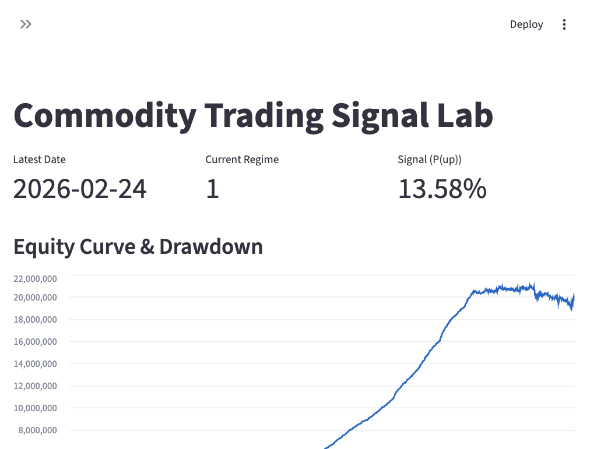

# Commodity Signal Lab

**End-to-end commodity trading signal & risk framework** — from raw market data to live dashboard. Built for production-style ML pipelines with real data, config-driven design, and no look-ahead leakage.

---

## Why I Built This

I built this to practice building a full ML pipeline from scratch: data ingestion, feature engineering, modeling, backtesting, and monitoring. The goal was to learn how these pieces fit together in a realistic setting — using real market data, avoiding look-ahead bias, and making the system config-driven so it’s easy to extend. It’s a learning project that doubles as a portfolio piece.

---

## What This Is

A full pipeline for commodity futures signals: ingest prices + macro, engineer features, train direction/return models, backtest with realistic costs, and monitor via a **Streamlit dashboard** with drift detection.



*Streamlit dashboard: latest signal, regime state, equity curve, drawdown, rolling Sharpe, drift summary.*

---

## Why It Matters

| Principle | Implementation |
|-----------|----------------|
| **No look-ahead** | Features use only past data; regime fit on expanding window |
| **Config-driven** | YAML configs for universe, features, model, backtest — no hardcoded logic |
| **Production-ready** | MLflow tracking, drift detection, schema validation, sklearn fallback when LightGBM unavailable |
| **Reproducible** | Single flow: fetch → features → train → backtest → dashboard |

---

## Quick Start

```bash
pip install -e ".[dev]"
cp .env.example .env   # optional: add FRED_API_KEY for macro (Mac: brew install libomp for LightGBM)

python scripts/fetch_data.py --all
python scripts/build_features.py --commodity CL_F
python scripts/train.py --commodity CL_F --model both
python scripts/backtest.py --commodity CL_F --model classifier
python scripts/drift_report.py --commodity CL_F
python scripts/run_dashboard.py   # → http://localhost:8501
```

---

## Pipeline Overview

| Step | Script | Output |
|------|--------|--------|
| 1. Ingest | `fetch_data.py --all` | `data/raw/*.parquet` (yfinance + FRED) |
| 2. Features | `build_features.py --commodity CL_F` | Technicals + macro + regimes |
| 3. Train | `train.py --commodity CL_F` | Models + MLflow runs |
| 4. Backtest | `backtest.py --commodity CL_F` | HTML/MD report, equity curve |
| 5. Drift | `drift_report.py --commodity CL_F` | `reports/drift_summary.json` |
| 6. Dashboard | `run_dashboard.py` | Streamlit app on port 8501 |

*Tech stack: pandas, numpy, scikit-learn, LightGBM, statsmodels, MLflow, Plotly, Streamlit, yfinance, pandas-datareader, pydantic.*

---

## Project Structure

```
commodity-signal-lab/
├── configs/           # universe, features, model, backtest (YAML)
├── src/signal_lab/
│   ├── ingestion/     # prices (yfinance), macro (FRED)
│   ├── features/      # technicals, macro alignment, regimes
│   ├── models/        # classifier, regressor (LightGBM/sklearn)
│   ├── backtest/      # engine, costs, risk, metrics
│   ├── mlops/         # tracking, drift
│   └── dashboard/     # Streamlit app
├── scripts/           # CLI entrypoints
├── tests/             # unit + integration
└── docs/              # screenshots, sample outputs
```

---

## Design Decisions

- **Regime detection**: k-means by default (volatility/returns); HMM optional via `pip install hmmlearn`
- **Model fallback**: If LightGBM fails (e.g. libomp on Mac), uses `HistGradientBoostingClassifier` — handles NaN natively
- **Macro alignment**: Timezone normalization (yfinance tz-aware vs FRED naive) before reindex
- **Backtest**: Position sizing (fixed/volatility), commission + slippage + spread; no walk-forward validation yet

---

## Data Sources (Real)

- **Commodities**: yfinance — CL=F, NG=F, GC=F, SI=F, HG=F, ZS=F (~2,800 rows each)
- **Macro**: FRED — CPI, industrial production, Fed funds, 10Y Treasury, dollar index, unemployment, payrolls

---

## Tests

```bash
pytest tests/ -v
```

6 tests: feature leakage, macro alignment, regime labels, backtest engine, CAGR.

---

## Sample Outputs

- **Dashboard**: [docs/dashboard_screenshot.png](docs/dashboard_screenshot.png) — Streamlit app with signals, regime, equity curve
- **Backtest metrics**: [docs/sample_backtest_metrics.md](docs/sample_backtest_metrics.md)

---

## Analysis & Verification

See [ANALYSIS.md](ANALYSIS.md) for data verification, backtest results, drift analysis, fixes applied, and answers to common questions.

---

## Caveats & Methodology

- **Backtest**: Single-asset, in-sample. No walk-forward validation or out-of-sample holdout. Position sizing is simplified; production would need slippage, execution latency, and margin modeling.
- **Model performance**: Classifier accuracy ~50% and regressor R² negative on test set — signals are weak, as expected for daily commodity returns. The framework is the focus, not alpha.
- **Data**: yfinance and FRED are free; institutional setups would use Bloomberg, Refinitiv, or vendor feeds.

---

## What I’d Improve to Reach Senior Level

Things I’d add or refine to move from junior to senior:

- **Walk-forward validation** — Proper train/val/test splits and rolling retraining instead of a single split
- **Stricter backtest** — Transaction costs, slippage, market impact, and survivorship bias checks
- **CI/CD** — GitHub Actions for tests, linting, and maybe model retraining on schedule
- **Monitoring** — Alerts on drift, model staleness, and data pipeline failures
- **Documentation** — API docs, architecture diagram, runbooks for common failures
- **Scale** — Multi-asset portfolios, cross-sectional signals, and proper risk aggregation

---

## License

MIT
